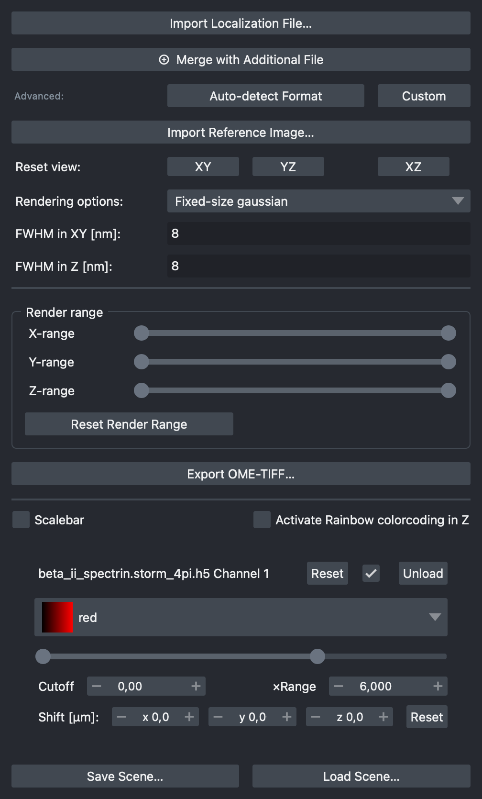
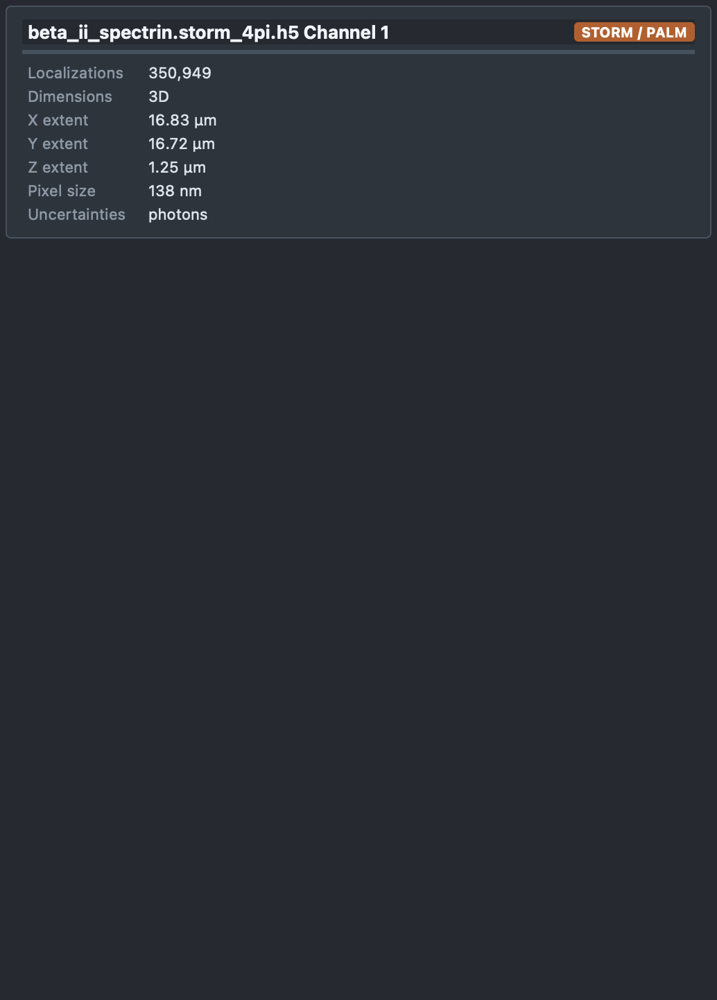
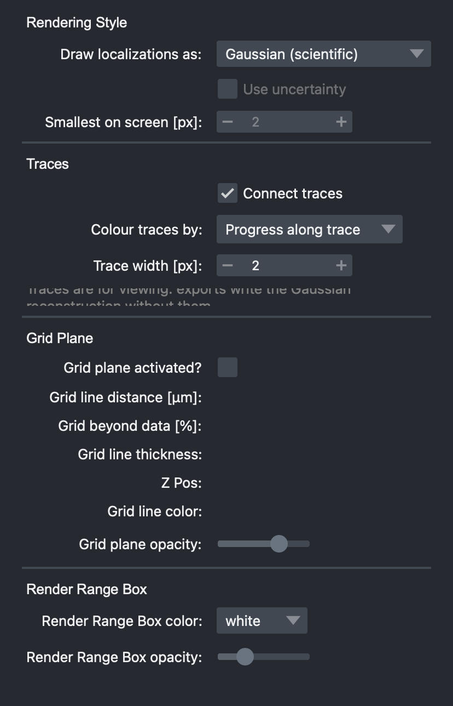
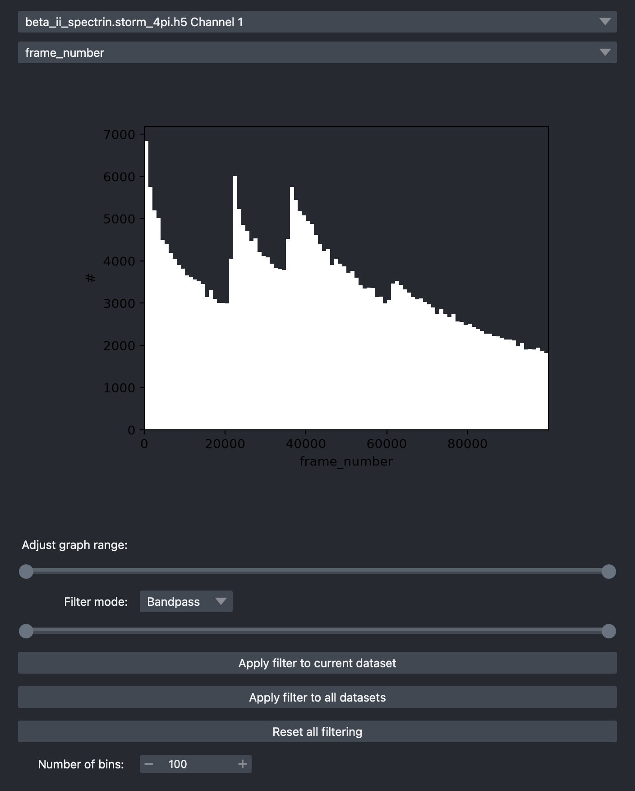
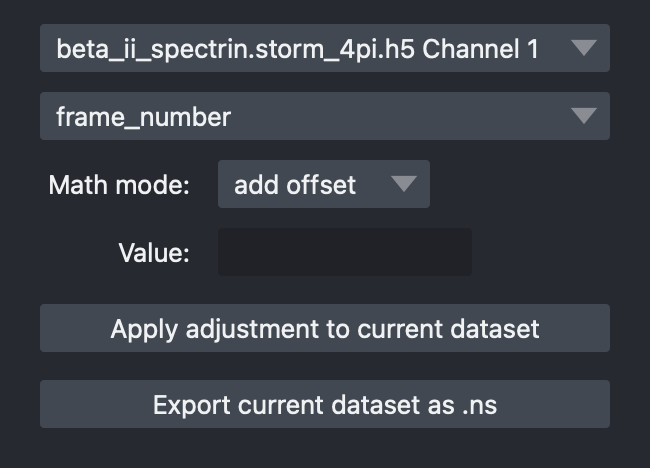

# Every control

Each tab of the dock, every control on it, and where it is explained. Labels
are written as the interface shows them.

## Data Controls

{ .dock align=right }

| Control | Does | More |
|---|---|---|
| **Import Localization File…** | Opens a file, replacing what is loaded | [Importing](importing.md) |
| **⊕ Merge with Additional File** | Adds a file as another dataset | [Several datasets](importing.md#several-datasets-at-once) |
| **Auto-detect Format** | Guided import of an unknown `.npy`, `.txt`, `.csv` or HDF5 layout | [Formats it does not know](importing.md#formats-it-does-not-know) |
| **Custom** | Runs your own import function | [Formats it does not know](importing.md#formats-it-does-not-know) |
| **Import Reference Image…** | Overlays a TIFF, PNG or JPEG | [Reference images](importing.md#reference-images) |
| **Reset view:** XY / YZ / XZ | Looks at one plane (3-D data) | [Views](navigating.md#views) |
| **Rendering options:** | Fixed-size or variable-size Gaussians | [Gaussian width](rendering.md#gaussian-width) |
| **FWHM in XY [nm]:**, **FWHM in Z [nm]:** | Width of every Gaussian (in variable mode: of the PSF) | [Gaussian width](rendering.md#gaussian-width) |
| **Min. FWHM in XY [nm]:**, **Min. FWHM in Z [nm]:** | Smallest width in variable mode | [Gaussian width](rendering.md#gaussian-width) |
| **Render range**: X-, Y-, Z-range, **Reset Render Range** | Restricts what is drawn to a box | [Render range](navigating.md#render-range) |
| **Save Scene…**, **Load Scene…** | Saves and restores settings | [Scenes](export.md#scenes) |
| **Export OME-TIFF…** | Writes a calibrated image | [Exporting](export.md) |
| **Scalebar**, **Size of Scalebar [nm]:** | A scale bar in the scene | [Scale bars](navigating.md#scale-bars) |
| **Activate Rainbow colorcoding in Z** | Colours 3-D data by depth | [Colour](rendering.md#colour) |

One card per dataset follows:

| Control | Does | More |
|---|---|---|
| checkbox | Shows or hides the dataset | |
| **Reset** | Contrast and opacity back to defaults | |
| **Unload** | Removes this dataset only | |
| colormap menu | The dataset's colours | [Colour](rendering.md#colour) |
| contrast slider, **Cutoff**, **×Range** | Maps the summed image to brightness | [Contrast](rendering.md#contrast) |
| **Shift [µm]:** x, y, z, **Reset** | Moves the dataset without changing its data | [Several datasets](importing.md#several-datasets-at-once) |

## File Infos

{ .dock align=right }

One card per dataset: its type, the number of localizations (and how many
pass the filters), how many are drawn within the render budget, its extent,
pixel size and uncertainties. Nothing here can be changed.

## Decorators

{ .dock align=right }

| Control | Does | More |
|---|---|---|
| **Draw localizations as:** | The rendering style | [Rendering styles](styles.md) |
| **Use uncertainty** | Sizes each localization by its uncertainty | [Options](styles.md#options) |
| **Smallest on screen [px]:** | Keeps markers visible when zoomed out | [Options](styles.md#options) |
| **Connect traces** | Joins each MINFLUX trace's localizations | [Traces](minflux.md#traces) |
| **Colour traces by:** | Trace, time, progress or a column | [Traces](minflux.md#traces) |
| **Trace width [px]:** | Line width | [Traces](minflux.md#traces) |
| **Grid plane activated?** and its six settings | A grid under the data | [Grid plane](navigating.md#grid-plane) |
| **Render Range Box color:**, **Render Range Box opacity:** | Draws the render range's edges | [Render range](navigating.md#render-range) |

## Data Filter

{ .dock align=right }

| Control | Does |
|---|---|
| dataset and property menus | What to filter, and by what |
| histogram, **Adjust graph range:** | The property's distribution, and how much of it to show |
| **Filter mode:** | **Bandpass** keeps inside the range, **Bandstop** outside |
| range slider | The band |
| **Apply filter to current dataset**, **Apply filter to all datasets** | Applies the band |
| **Reset all filtering** | Brings everything back |
| **Number of bins:** | Histogram resolution |

See [Filtering](filtering.md#filtering).

## Data adjustment

{ .dock align=right }

| Control | Does |
|---|---|
| dataset and property menus | What to change |
| **Math mode:** | **add offset** or **rescale** |
| **Value:** | By how much |
| **Apply adjustment to current dataset** | Changes the loaded values |
| **Export current dataset as .ns** | Saves the dataset as napari-storm's HDF5 format |

See [Adjusting values](filtering.md#adjusting-values).

## Post-proc.

Needs the `[comet]` extra to run COMET and detect fiducials; the rest works
without it.

| Control | Does |
|---|---|
| dataset menu | Which dataset the tab acts on |
| **Fiducials** (collapsed) | **Detect fiducials**, tick candidates, **Exclude ticked fiducials** / **Restore fiducials** |
| **Grouping** (collapsed, STORM) | **Max distance**, **Max dark frames**, **Max frames**; **Group localizations** |
| **Max drift [nm]** | The largest distance the sample moved; COMET's pair radius |
| **Localizations** / **Group means** | What COMET estimates from |
| **Localizations per time window** | COMET's window size (means per window with group or trace means) |
| **Keep localizations** | Random, reproducible share used when memory is short |
| **Estimate memory** / **Run COMET** / **Cancel** | Check the memory budget, run, stop |
| **Undo** / **Re-apply** / **Discard drift** | Restore the raw positions, apply again, forget the drift |
| **Save drift…** / **Load drift…** / **Apply to other datasets…** | Share a drift between files and channels |
| **Save corrected localizations…** | `.ns` with the correction applied |
| **Correction** slider, **Play** | Show raw → corrected in 10 % steps; exports keep the applied data |
| **x, y, time view (2D)** | Draw time as height |
| **Show pair network**, **Pair radius**, mode | Vectors between localizations that belong together |

See [Post-processing and drift correction](post-processing.md).

## Detaching tabs

Double-click a tab, or drag it out of the dock, to open it in a window of its
own. Close that window, or double-click its title bar, to put it back.

## Keyboard

See [Navigating](navigating.md#keyboard).
