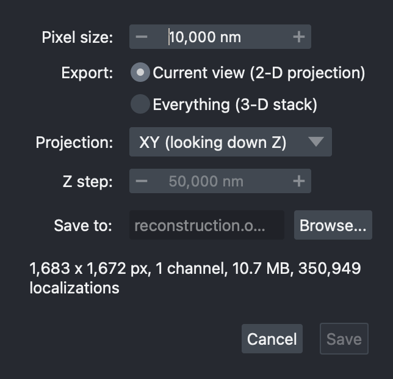

# Export and scenes

## Exporting an image

{ .dock align=right }

**Export OME-TIFF…** in Data Controls rasterizes the reconstruction and writes
it as an OME-TIFF with its pixel size recorded, so Fiji, napari and other
OME-aware software open it at the right scale.

* **Pixel size:** in nanometres, 10 nm by default.
* **Export:**
    * **Current view (2-D projection)** -- the area of the current
      [render range](navigating.md#render-range), projected along the axis
      chosen in **Projection:** -- **XY** looking down Z, **XZ** looking along
      Y, or **YZ** looking along X;
    * **Everything (3-D stack)** -- the whole dataset as a stack of slices
      **Z step:** apart (50 nm by default).
* **Save to:** the file, `*.ome.tif`.

Each loaded dataset becomes one channel of the file -- hidden ones included.

Three things are worth knowing:

* **It never downsamples to fit.** The pixel size you ask for is the pixel
  size you get, so a small pixel size over a large area makes a large file.
  The dialog shows the image dimensions, the file size and any warnings as you
  change the settings -- before anything is written. Writing happens in tiles,
  in the background, and can be cancelled.
* **It exports what your filters left**, not what the screen shows. If a large
  dataset is drawn as a subsample to stay within the
  [render budget](rendering.md#how-much-is-drawn), the export still contains
  every localization that passed the filters.
* **It exports the reconstruction only**: the summed Gaussians, evaluated in
  floating point. [Rendering styles](styles.md), [traces](minflux.md#traces),
  the grid and scale bars are for viewing and are not written.

To save the *data* rather than an image, use **Export current dataset as .ns**
in the [Data adjustment](filtering.md#adjusting-values) tab.

## Scenes

**Save Scene…** writes this session's *settings* to a small JSON file,
`session.napari-storm.json` by default:

* each dataset's name, the file it came from, its alignment and its
  appearance -- colormap, contrast, visibility;
* the Gaussian width settings, the rendering style and the trace settings;
* reference images and their placement;
* the camera.

The localizations are not copied into it. A scene records where the data came
from rather than duplicating it, so it stays small.

**Load Scene…** applies a saved scene to the datasets that are loaded now; it
does not open files itself. Open the same files first, then load the scene.
