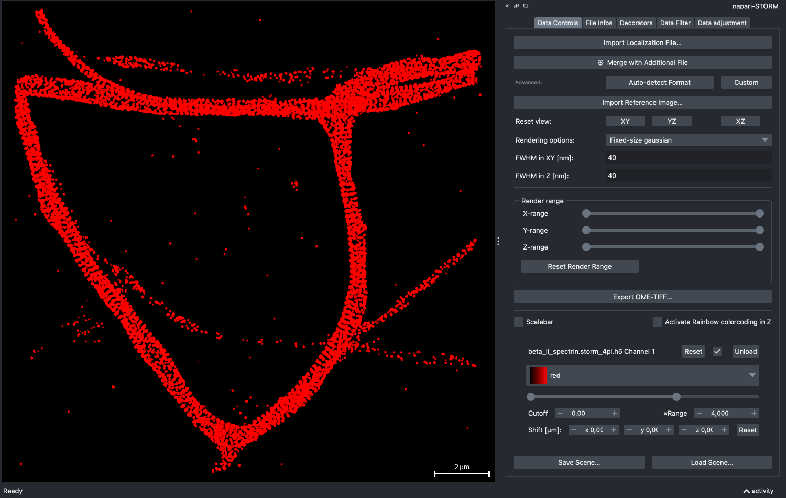

# Getting started

This page takes you from an empty environment to a rotated, filtered 3-D
reconstruction of the sample dataset. Each step links to the page that covers
it in full.

## 1. Install

napari-storm needs Python 3.10–3.12. Give it an environment of its own, for
example with conda:

```bash
conda create --name napari-storm python=3.11 pip
conda activate napari-storm
```

Then install it from PyPI with a Qt binding:

```bash
pip install "napari-storm[pyqt6]"
```

The extras choose what comes with it:

| Extra | Adds | When you need it |
|---|---|---|
| `[pyqt6]` | napari with PyQt6 | Almost always: without a Qt binding napari cannot open a window |
| `[pyside6]` | PySide6 | Instead of `[pyqt6]`, if you prefer PySide |
| `[minflux]` | `zarr<3` | To open MINFLUX `.zarr` stores -- see [MINFLUX](minflux.md#zarr-stores) |
| *(none)* | -- | Installing into an application that already provides napari and Qt |

Extras combine: `pip install "napari-storm[pyqt6,minflux]"`.

To work on napari-storm itself, install from a clone instead:

```bash
git clone https://github.com/napari-storm/napari-storm
cd napari-storm
pip install -e ".[dev,pyqt6]"
```

## 2. Start it

With the environment active, run

```bash
napari-storm
```

This opens napari with the napari-storm dock on the right and napari's own
layer list hidden, since the dock takes over its job. `python -m napari_storm`
does the same. You can also start plain `napari` and open the dock from
**Plugins → Napari STORM**; that way napari's own panels stay visible.

Before anything is loaded the dock shows one tab, **Data Controls**.

## 3. Open a dataset

The examples in this documentation use the 4Pi STORM measurement of beta-II
spectrin in the repository's
[`sample_data`](https://github.com/napari-storm/napari-storm/tree/main/sample_data)
folder, `beta_ii_spectrin.storm_4pi.h5` -- 350,949 localizations in 3-D. If you
installed from PyPI, download that one file from GitHub.

Open it with **Import Localization File…** at the top of the dock, or drag the
file onto the napari window. Reading happens in the background with a
progress dialog; **Cancel** abandons the import and leaves whatever was
already loaded untouched.

[Importing data](importing.md) lists every format napari-storm reads.

## 4. Find your way around



The canvas is on the left and the dock on the right. Once data is loaded the
dock has five tabs:

| Tab | What it is for |
|---|---|
| **Data Controls** | Opening files, the Gaussian width, render range, views, export, and one card per loaded dataset with its colormap, contrast and alignment |
| **File Infos** | What each dataset contains: type, number of localizations, extent, pixel size, uncertainties |
| **Decorators** | How localizations are drawn (the rendering style), MINFLUX traces, the grid plane and the render-range box |
| **Data Filter** | Histogram filters on any property of the data |
| **Data adjustment** | Offsetting or rescaling a property, and saving the result |

Double-click a tab, or drag it out, to give it a window of its own; that way
several are visible at once. Close the window to put the tab back.

[Every control](controls.md) shows each tab in full.

## 5. Make it look right

The defaults draw every localization 20 nm wide (FWHM), with the contrast
set so that a single localization is at full brightness. On dense data that
saturates; three changes make the spectrin rings visible:

1. Set **FWHM in XY [nm]** and **FWHM in Z [nm]** to `40`.
2. In the dataset's card, set the right-hand contrast box (**×Range**) to `4`:
   now it takes four overlapping localizations to reach full brightness.
3. Tick **Activate Rainbow colorcoding in Z** to colour by depth.

[Rendering and contrast](rendering.md) explains what these numbers mean.

## 6. Look at it in 3-D

Drag in the canvas to rotate, scroll to zoom. **Reset view: XZ** looks at the
data side-on -- for this 4Pi dataset that shows its two layers -- and **XY**
returns to the top view. The keys <kbd>w</kbd>/<kbd>s</kbd> zoom,
<kbd>a</kbd>/<kbd>d</kbd> and <kbd>q</kbd>/<kbd>e</kbd> rotate in 30° steps,
and <kbd>r</kbd> resets the camera.

[Navigating in 2-D and 3-D](navigating.md) has the rest, including the render
range and the grid plane.

## 7. Keep what you did

**Export OME-TIFF…** writes the reconstruction as a calibrated image, and
**Save Scene…** saves your settings -- colours, widths, camera, alignment --
so that **Load Scene…** can restore them later. See
[Export and scenes](export.md).
