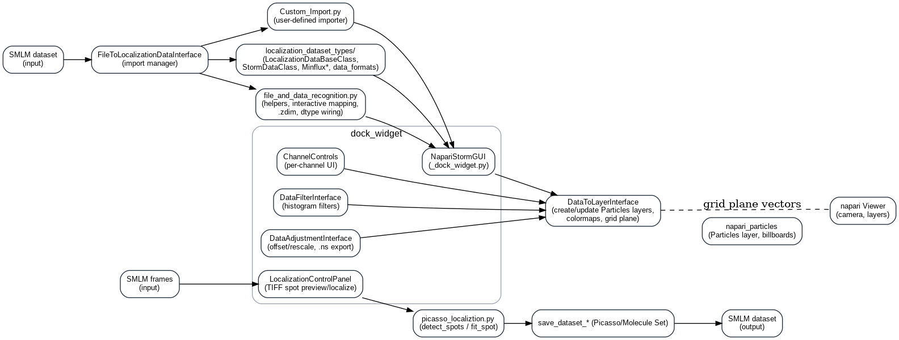

# How it Works

napari-storm uses a **GPU-accelerated billboard rendering strategy** for sparse single-molecule data.  

---

## Core Idea
Instead of voxelizing the space (where most voxels are empty for the typical SMLM dataset), each localization is drawn as a **billboarded Gaussian** (two triangles always facing the camera). This:
- Reduces memory usage
- Minimizes GPU fill cost
- Retains accurate point footprints
- Enables smooth exploration of **millions of localizations**

---

## Architecture Overview

