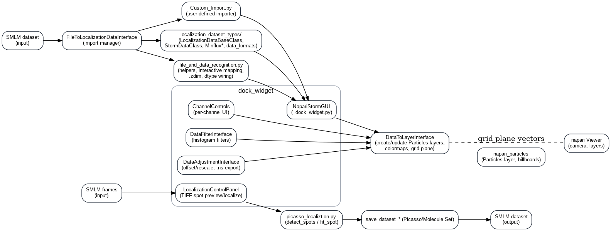

# How it Works

napari-storm uses a **GPU-accelerated billboard rendering strategy** for sparse
single-molecule data.

---

## Core Idea

Instead of voxelizing the space — where most voxels are empty for the typical
SMLM dataset — each localization is drawn as a **billboarded Gaussian**: two
triangles that always face the camera, shaded so their footprint is the
point spread function rather than a flat disc. This:

- Reduces memory usage
- Minimizes GPU fill cost
- Retains accurate point footprints
- Enables smooth exploration of **millions of localizations**

The Gaussian on screen is the one the settings ask for: its covariance is the
orthographic projection of the localization's `diag(σz², σy², σx²)` onto the
screen, so anisotropic and axial widths survive any rotation, and a test
measures the drawn width against the model on both backends. Two things
remain display approximations, on purpose: the canvas cuts each Gaussian at
three sigma (the export evaluates five), and it ends in an 8-bit framebuffer,
so very dense regions clip on screen but not in an export. The exported
floating-point image is the quantitative reference.

---

## Deciding and drawing are separate

The two halves of the plugin are split on purpose:

* **The planner** decides *what* to draw — Gaussian widths, intensity
  weighting, coordinates in nanometres. It is plain numpy, with no napari, no
  Qt and no VisPy, and a test enforces that in a subprocess where all three are
  made unimportable. This is the part that is science rather than presentation,
  and it is testable without a viewer.
* **A backend** decides *how*, and owns the GPU resources.

That split is what lets a host application drive napari-storm without adopting
the dock widget — see [Embedding](embedding.md).

---

## Two backends, one contract

The quads are drawn by **instancing**: one quad is uploaded once and reused for
every localization, with only centre, width and value stored per point. Where a
GL session cannot instance, an older path that builds six real vertices per
localization takes over, with a warning. Both satisfy the same renderer
contract and every contract test runs against both — the image is the same, and
the difference is roughly 11× in memory.

| Backend | Bytes/localization | 5M update |
|---|---:|---:|
| Instanced | 28 | 0.16 s |
| Billboard (fallback) | 304 | 2.47 s |

`select_renderer(viewer)` makes the choice; in practice the fast path is the one
you get, because instancing needs VisPy's `gl+`, which napari already selects
for its own Points layer.

---

## Traces are planned, then drawn

Connecting a MINFLUX trace's localizations follows the same split. The planner
groups the rows it has just planned for the splats by trace and sorts each by
time -- concurrent traces arrive interleaved in a MINFLUX file -- reusing the
same coordinates, so a line runs exactly through its localizations whatever
alignment or filter applies. A backend then draws them as a napari Tracks
layer with every vertex at one time point, so napari's time slider never hides
part of a path. The overlay is a visualisation: it is not part of the
reconstruction, and no export writes it.

---

## Architecture Overview

