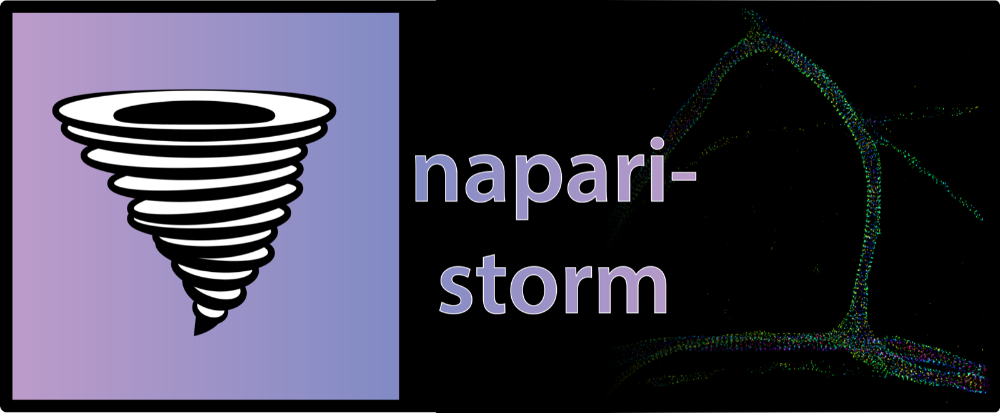

# napari-storm

**napari-storm** is a [napari](https://napari.org) plugin for looking at
single-molecule localization microscopy data -- STORM, PALM, DNA-PAINT,
MINFLUX -- interactively, in 2-D and 3-D, at the scale of millions of
localizations.

Each localization is drawn as a small Gaussian on the GPU rather than binned
into a voxel grid, so the picture is a reconstruction you can rotate, zoom
and filter without waiting for it to be recomputed. See
[How it works](how-it-works.md) for the detail.

---

## What it does

<div class="grid cards" markdown>

-   **Opens what your software writes**

    ---

    Picasso, ThunderSTORM, the SMLM zip format, and Abberior MINFLUX in both
    of Imspector's layouts, including pyMINFLUX's `.pmx`.

    [Importing data →](importing.md)

-   **Renders a reconstruction you can trust**

    ---

    Fixed-size or precision-weighted Gaussians, with a contrast control that
    acts on the summed image -- so its numbers count overlapping
    localizations.

    [Rendering and contrast →](rendering.md)

-   **Shows the same data other ways**

    ---

    Seventeen rendering styles, from the scientific Gaussian to spheres,
    rings and uncertainty ellipses.

    [Rendering styles →](styles.md)

-   **Follows MINFLUX traces**

    ---

    Each molecule's localizations joined in the order they were measured,
    coloured by trace, by time or by a column of the data.

    [MINFLUX →](minflux.md)

-   **Filters by any property**

    ---

    Band-pass and band-stop filters on a histogram of photons, precision,
    frame, `efo`, `cfr` -- whatever the file carries.

    [Filtering →](filtering.md)

-   **Exports calibrated images**

    ---

    OME-TIFF at the pixel size you ask for, never downsampled to fit, as a
    2-D projection or a 3-D stack.

    [Export and scenes →](export.md)

</div>

It can also run without its dock: a host application -- an acquisition GUI,
a notebook -- can hand localizations to the renderer directly. See
[Embedding](embedding.md).

---

## Install

napari-storm needs Python 3.10–3.12:

```bash
conda create --name napari-storm python=3.11 pip
conda activate napari-storm
pip install "napari-storm[pyqt6]"
napari-storm
```

[Getting started](getting-started.md) explains the choices -- the Qt
binding, the `[minflux]` extra for `.zarr` files -- and walks through a first
session with the sample data.

---

## Where to go next

* New to napari-storm: [Getting started](getting-started.md).
* Looking for one control: [Every control](controls.md).
* Something does not work: [Troubleshooting](troubleshooting.md).
* What changed between versions: [Changelog](changelog.md).
* Driving napari-storm from your own code: [Embedding](embedding.md) and the
  [API reference](api.md).
