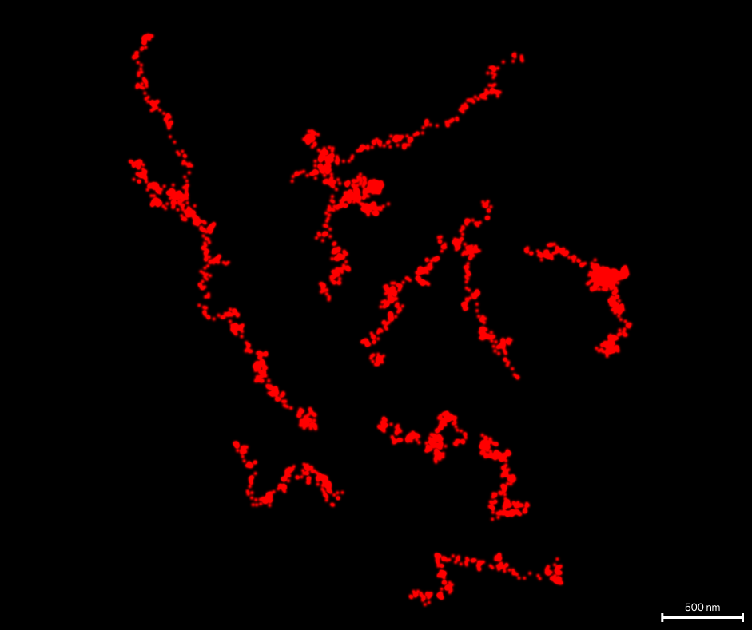
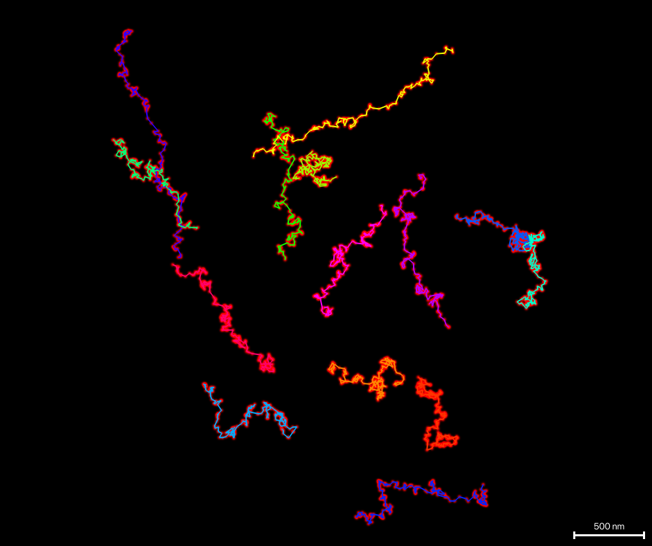
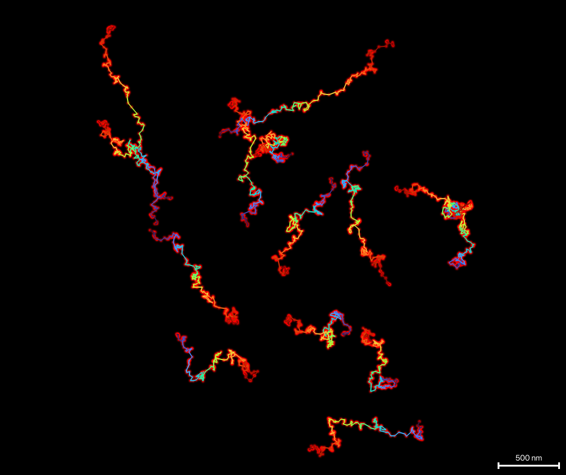

# MINFLUX

napari-storm reads Abberior MINFLUX exports and can join each molecule's
localizations into a trace.

## Layouts and containers

Imspector has written MINFLUX data in two layouts:

* the **original layout**, one record per trace with its iterations nested
  inside it;
* the **flat layout** of Imspector **24.10** and later, one row per
  iteration, with the last localization of each cycle marked final (`fnl`).

Which layout a file holds is read from the file -- from a `.npy`'s header or a
`.json`'s first record, so even a very large file is routed at once. There is
nothing to choose.

| Container | Original layout | 24.10+ layout | Needs |
|---|:---:|:---:|---|
| `.npy` | ✓ | ✓ | |
| `.json` | ✓ | ✓ | |
| `.mat` | | ✓ | |
| `.zarr` | | ✓ | the `[minflux]` extra -- see [below](#zarr-stores) |
| `.pmx` (pyMINFLUX, file version 3.0) | | ✓ | |
| `.mfx` (an older napari-storm MINFLUX file) | ✓ | | |

From the flat layout napari-storm draws the final localization of each cycle
and leaves out invalid ones (`vld` false). In both layouts positions are
converted from metres to nanometres, and z is scaled by 0.8, an axial
correction for the refractive-index mismatch between immersion medium and
sample.

## Zarr stores

Imspector stores the MINFLUX table as a structured array, which zarr 3 cannot
read, so `.zarr` needs `zarr<3`. That is not installed by default -- host
applications that only use napari-storm to render may already have moved to
zarr 3 -- so install it with the extra:

```bash
pip install "napari-storm[minflux]"
```

Without it every other container still opens, and opening a `.zarr` store
says which command to run.

A store is a folder, not a file, and a file dialog cannot select a folder.
Pick any file *inside* the store -- its `.zgroup`, for instance -- and the
whole dataset opens. Dropping the folder onto napari works too.

## Traces

A MINFLUX trace is one molecule localized again and again; the file records
which localizations belong together (`tid`). Tick **Connect traces** in the
Decorators tab to draw each trace as a line through its own localizations,
in the order they were measured. For a tracking experiment that is the path
the molecule took; for a fixed sample, how far its repeated localizations
wander.

<div class="gallery wide" markdown>
<figure markdown>

<figcaption>Localizations alone</figcaption>
</figure>
<figure markdown>

<figcaption>Connected, coloured by trace</figcaption>
</figure>
<figure markdown>

<figcaption>Coloured by progress along each trace</figcaption>
</figure>
</div>

*Synthetic random walks in the Imspector 24.10 layout, read by the real
reader: no tracking measurement ships with napari-storm.*

**Colour traces by:**

* **Trace** -- every trace its own colour, kept when filters change;
* **Time** -- when each localization was measured;
* **Progress along trace** -- from each trace's first localization to its
  last, which shows the direction a tracked molecule moved;
* any numeric column of the data, `efo` or `cfr` for instance. If a column is
  missing from some of the loaded datasets, those are coloured by trace.

**Trace width [px]:** sets the line width on screen, from 1 to 8. Your
graphics driver may draw lines no wider than some limit.

The lines go wherever the localizations go: they follow filters, the render
range, a dataset's shift and its show/hide and opacity, and a dataset loaded
later gets its traces too. A trace with only one localization showing draws
nothing.

Data that does not identify its traces -- STORM and PALM files, for example
-- has nothing to connect: the checkbox is greyed out, and its tooltip says
why. Deleting a trace layer from napari's layer list switches traces off
without unloading anything.

Traces are for viewing. They are not part of the reconstruction, and no export
contains them. They are drawn as a napari Tracks layer with every point at one
time, so napari's time slider never hides part of a path; time is shown by
colour instead.

## Sample files

The repository's
[`sample_data`](https://github.com/napari-storm/napari-storm/tree/main/sample_data)
folder has a small MINFLUX file in each container -- `.npy` in both NumPy
format versions, `.json` in both layouts, `.mat` and `.pmx`. They are written
to the documented layout rather than measured: 64 localizations of ramp data,
enough to check that a container opens, not to see what an acquisition looks
like.

## Acknowledgement

The flat layout's details -- the markers that tell the two layouts apart, the
quirks of each container, the structure of `.pmx` -- were read from
[pyMINFLUX](https://pyminflux.ethz.ch/) by the Single Cell Facility of the
D-BSSE, ETH Zurich. napari-storm's reader is an independent implementation
and contains no pyMINFLUX code.
