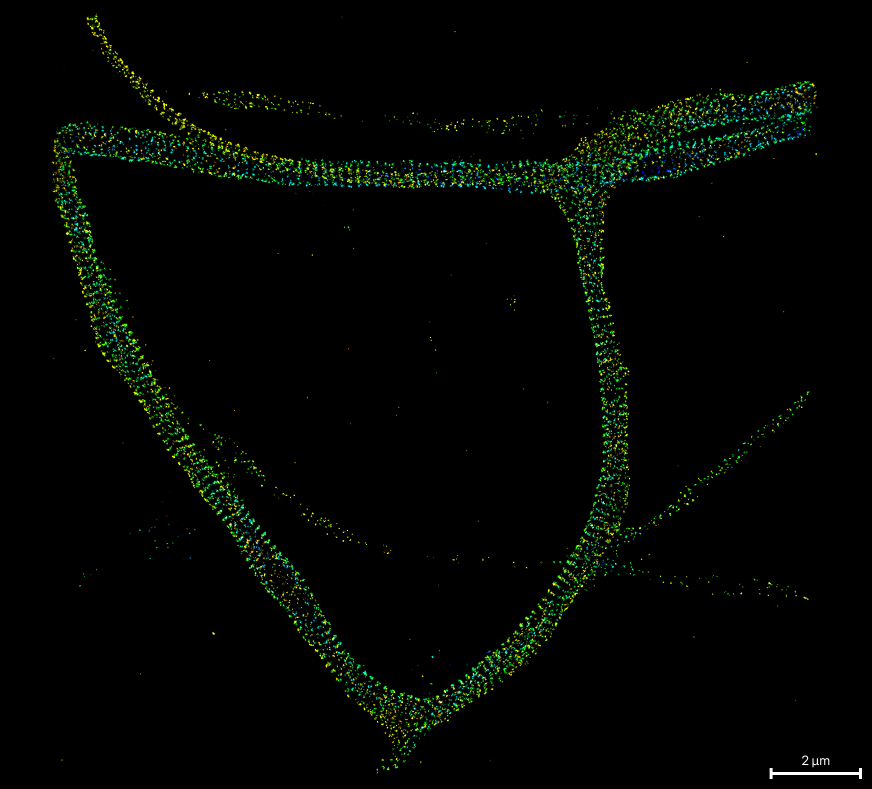
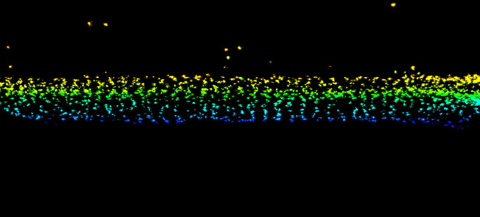
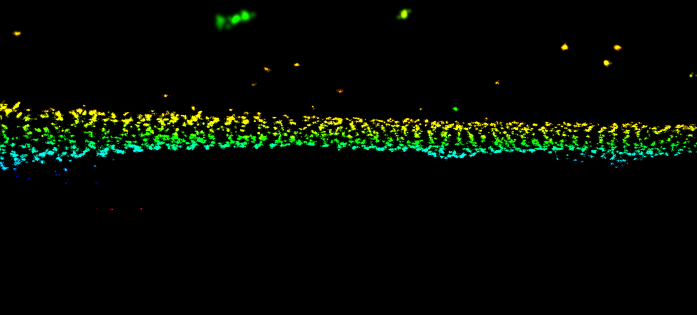
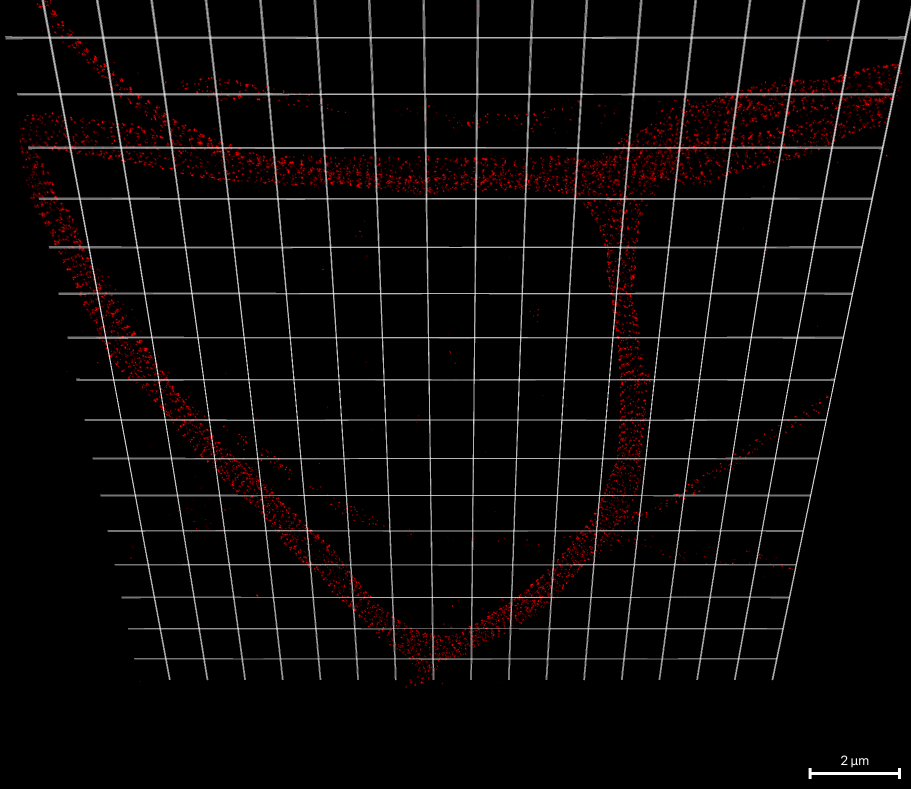

# Navigating in 2-D and 3-D

3-D data opens in napari's 3-D view, looking down onto the XY plane; 2-D data
opens flat.

## Mouse

napari's own controls apply. In 3-D, drag to rotate and hold
<kbd>Shift</kbd> while dragging to pan; in 2-D, drag to pan. Scroll to zoom in
either.

## Keyboard

napari-storm adds these keys to the viewer:

| Key | Does |
|---|---|
| <kbd>w</kbd> / <kbd>s</kbd> | Zoom in / out by 10 % |
| <kbd>a</kbd> / <kbd>d</kbd> | Rotate the view by 30° one way / the other |
| <kbd>q</kbd> / <kbd>e</kbd> | Tilt the view by 30° up / down, stopping at ±90° |
| <kbd>r</kbd> | Reset the camera to the starting view |
| <kbd>↑</kbd> <kbd>↓</kbd> <kbd>←</kbd> <kbd>→</kbd> | Move everything in the view by 50 nm |

The arrow keys move what is drawn, not the data, and are not the same as a
dataset's **Shift [µm]:** alignment; use that to align one channel against
another (see [Several datasets at once](importing.md#several-datasets-at-once)).

## Views

**Reset view:** in Data Controls points the camera at one plane: **XY** from
above, **XZ** and **YZ** from the side. It returns to the starting zoom and
centre. The buttons appear for 3-D data only.

<figure markdown>

<figcaption>XY</figcaption>
</figure>
<figure markdown>

<figcaption>XZ: the sample from the side, coloured by depth</figcaption>
</figure>
<figure markdown>

<figcaption>YZ</figcaption>
</figure>

## Render range

The **Render range** group restricts what is drawn to a box: **X-range**,
**Y-range** and, for 3-D data, **Z-range**, each a two-handle slider.
Narrowing Z is the quickest way to look at one slice of a thick sample.
**Reset Render Range** draws everything again. The range does not filter the
data; it does set the area of a **Current view** [export](export.md).

**Render Range Box** in the Decorators tab draws the box's edges in 3-D, with
a colour and an opacity.

## Grid plane

Tick **Grid plane activated?** in the Decorators tab to draw a grid under the
data -- a sense of scale and orientation when rotating in 3-D. Its options:

* **Grid line distance [µm]:** the spacing of the lines;
* **Grid beyond data [%]:** how far the plane runs past the render range, as
  a share of each axis' span, at both ends; 0 stops it at the range;
* **Grid line thickness:**;
* **Z Pos:** the height of the plane;
* **Grid line color:** and **Grid plane opacity:**.

The grid follows the render range.

## Scale bars

There are two, and they do different jobs:

* **napari's scale bar**, bottom right of the canvas, is always on. It
  measures the screen and picks a round length as you zoom.
* The **Scalebar** checkbox in Data Controls adds a bar *in the scene*, of the
  length set in **Size of Scalebar [nm]:** (500 nm by default). It is an
  object among the data rather than an overlay on the screen, so in 3-D it
  rotates with them.
