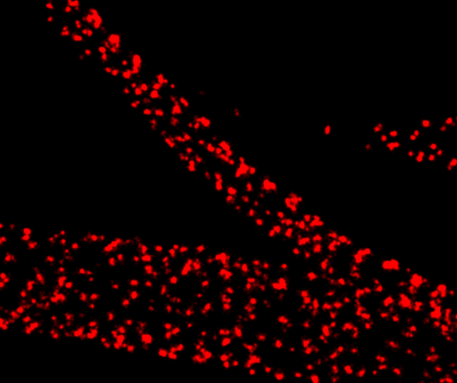
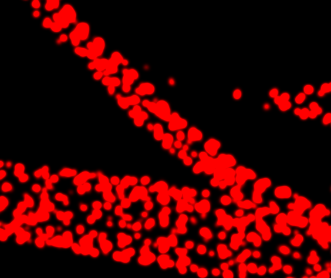
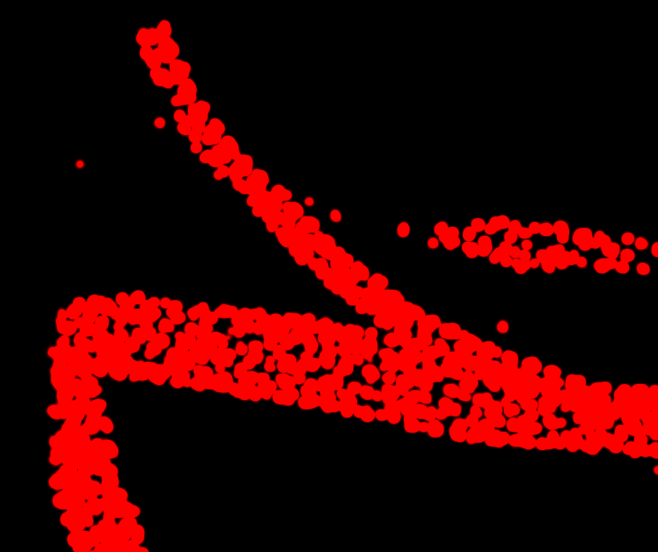
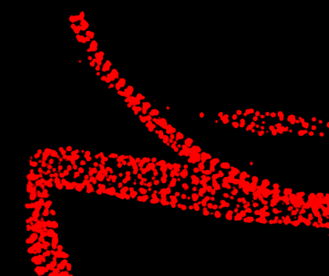

# Rendering and contrast

napari-storm draws every localization as a Gaussian and adds up the
Gaussians where they overlap. Two settings decide what you see: how wide each
Gaussian is, and how the summed image is mapped to brightness.

## Gaussian width

**Rendering options:** in Data Controls offers two modes.

**Fixed-size gaussian** draws every localization at the same width. Set it
with **FWHM in XY [nm]:** and **FWHM in Z [nm]:** -- both default to 20 nm.

<div class="gallery wide" markdown>
<figure markdown>

<figcaption>FWHM 15 nm</figcaption>
</figure>
<figure markdown>

<figcaption>FWHM 40 nm</figcaption>
</figure>
<figure markdown>

<figcaption>FWHM 100 nm</figcaption>
</figure>
</div>

Too narrow and the image breaks into specks; too wide and structure blurs
together. A width close to the localization precision of the data is a good
start.

**Variable-size gaussian** draws each localization at its own measured
precision, taken from the uncertainty or photon count in the file. The fields
change meaning:

| Field | Meaning | Default |
|---|---|---|
| **PSF FWHM in XY [nm]** | the width of the microscope's PSF, which the precision is scaled from | 300 |
| **PSF FWHM in Z [nm]** | the same, axially | 700 |
| **Min. FWHM in XY [nm]:** | a floor, so a very precise localization does not shrink to nothing | |
| **Min. FWHM in Z [nm]:** | the floor, axially (3-D data only) | |

Variable size is only offered when every loaded dataset is STORM/PALM data;
with MINFLUX or plain localizations loaded, the menu returns to
**Fixed-size gaussian**. A localization with neither an uncertainty nor a
photon count is drawn at the floor. Switching modes puts the width fields
back to that mode's defaults, and switches depth colouring off -- it is not
available in variable mode.

!!! note "Widths are FWHM, not σ"

    Every width field is a full width at half maximum in nanometres. The
    renderer works in σ and converts for you (σ = FWHM / 2.355). If you have
    a σ in mind, multiply it by 2.355 first: a 30 nm σ is a 70.6 nm FWHM.

**A size safety cap.** The cost of drawing a Gaussian grows with the area it
covers on screen, regardless of how many there are, so a few enormous ones can
stall the GPU. Each is therefore clamped to half the field of view, and a
notification says when that happened. Only the faint outer tail of a
Gaussian already much larger than the screen is lost.

## Contrast

Each dataset's card in Data Controls has a two-handle contrast slider with two
boxes beneath it, **Cutoff** and **×Range**. They act on the reconstruction
itself -- the sum of the Gaussians -- so with fixed-size Gaussians their
numbers count overlapping localizations:

* **×Range**, the right handle, is how many overlapping localizations it
  takes to reach full brightness. The default, 1, saturates the centre of a
  single Gaussian, which suits sparse data and saturates dense data.
* **Cutoff**, the left handle, hides everything where fewer localizations
  overlap than this. At 2, a lone localization disappears while clusters
  stay.

<div class="gallery wide" markdown>
<figure markdown>

<figcaption>Default: ×Range 1 saturates dense bands</figcaption>
</figure>
<figure markdown>

<figcaption>×Range 10: the bands resolve</figcaption>
</figure>
<figure markdown>

<figcaption>Cutoff 2 as well: lone localizations drop out</figcaption>
</figure>
</div>

Both handles share one logarithmic scale from 0.01 to 100; type exact values
into the boxes. With variable-size Gaussians each localization contributes
according to its precision rather than counting as one.

Rendering styles that draw opaque markers instead of Gaussians have no sum
to act on. With those the slider maps each marker's own value onto the
colormap, and it keeps separate handle positions for when you switch back.
See [Rendering styles](styles.md).

## Colour

The **colormap** menu in each card offers red, green, blue, yellow, cyan,
pink, orange, mint, purple, gray and red hot. Choosing different colormaps for
different datasets is how channels are told apart.

**Activate Rainbow colorcoding in Z** colours 3-D data by depth instead. A
colour bar with the depth range appears in Data Controls; each dataset is
scaled to its own z range. While it is on, each card shows an opacity slider
instead of a colormap. It is not available for 2-D data or with
variable-size Gaussians.

## How much is drawn

Drawing costs host memory -- 28 bytes per localization on the usual renderer,
304 on the fallback one -- before napari's and the GPU's own copies. To keep a
very large import from exhausting memory, napari-storm draws at most a 2 GB
budget's worth, roughly 6.7 million localizations shared between all loaded
datasets. Beyond that it draws an evenly spaced subsample and says how many of
your localizations are on screen. All of them stay loaded: filters and exports
still use the full dataset.

Set `NAPARI_STORM_RENDER_BUDGET_MB` before starting napari to change the
budget, or set it to `0` to remove it:

```bash
NAPARI_STORM_RENDER_BUDGET_MB=8192 napari-storm
```

## Screen and export

The canvas is a display. It cuts each Gaussian at three σ and ends in an 8-bit
framebuffer, so very dense regions clip on screen. The
[OME-TIFF export](export.md) evaluates each Gaussian to five σ in floating
point, and is the image to measure.
