# Rendering styles

**Rendering Style**, at the top of the Decorators tab, chooses what each
localization is drawn as. **Gaussian (scientific)** -- the reconstruction --
is the default and the only style an export writes. The others, listed under
**Alternative visualisations**, are for looking: for seeing individual
localizations, for depth in 3-D, or for a figure.

Every image on this page shows the same patch of the spectrin sample, about
1 µm across, at 8 nm FWHM with **Smallest on screen [px]:** at 10, each
exposed so it does not clip.

## The reconstruction

<figure markdown>
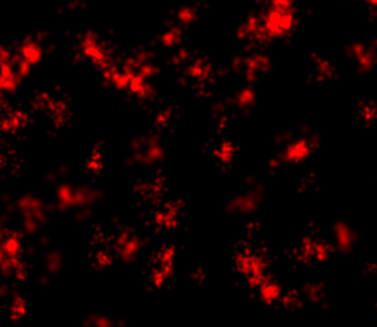
<figcaption><strong>Gaussian (scientific)</strong> — Each localization as a Gaussian, summed: the reconstruction, and what an export writes.</figcaption>
</figure>

Gaussians add up where they overlap, which is what makes the image a density
and what the [contrast](rendering.md#contrast) control acts on.

## Markers

Opaque shapes, one σ in radius: a nearer marker hides a farther one instead
of adding to it. Good for seeing individual localizations and, with spheres,
for depth.

<figure markdown>

<figcaption><strong>Points</strong> — Opaque points, one sigma in radius; nearer points hide farther ones.</figcaption>
</figure>
<figure markdown>
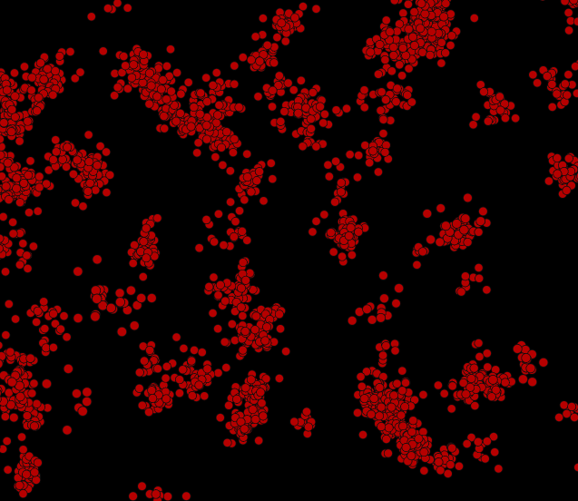
<figcaption><strong>Outlined points</strong> — Points with a dark rim, so overlapping ones stay apart.</figcaption>
</figure>
<figure markdown>
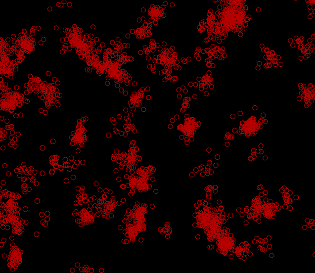
<figcaption><strong>Rings</strong> — The one-sigma outline alone: with widths from the uncertainty, an uncertainty ellipse per localization.</figcaption>
</figure>
<figure markdown>

<figcaption><strong>Spheres</strong> — Lit spheres, for depth perception in 3-D.</figcaption>
</figure>
<figure markdown>
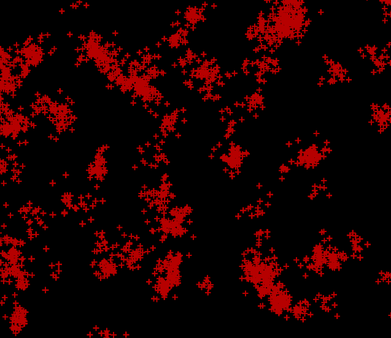
<figcaption><strong>Crosses</strong> — A plus sign per localization.</figcaption>
</figure>
<figure markdown>

<figcaption><strong>Squares</strong> — A filled square per localization.</figcaption>
</figure>
<figure markdown>
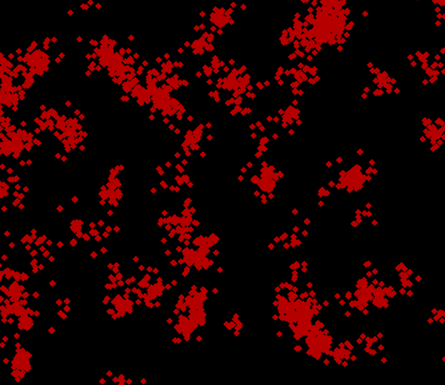
<figcaption><strong>Diamonds</strong> — A filled diamond per localization.</figcaption>
</figure>
<figure markdown>
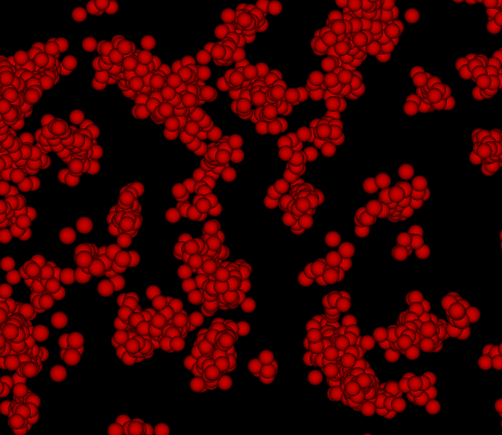
<figcaption><strong>Domes</strong> — napari-particles' sphere: brightest at the centre, cut at the rim.</figcaption>
</figure>

## Sprites

Shapes from Martin Weigert's
[napari-particles](https://github.com/maweigert/napari-particles), which glow
and add up where they overlap, as the Gaussian does. The contrast control
acts on their sum.

<figure markdown>

<figcaption><strong>Glow</strong> — napari-particles' particle: a bright core with a long halo.</figcaption>
</figure>
<figure markdown>
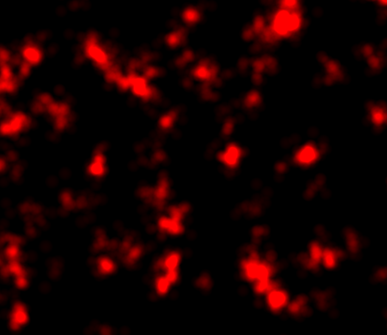
<figcaption><strong>Bubbles</strong> — napari-particles' bubble: a shell, brightest at its rim.</figcaption>
</figure>
<figure markdown>
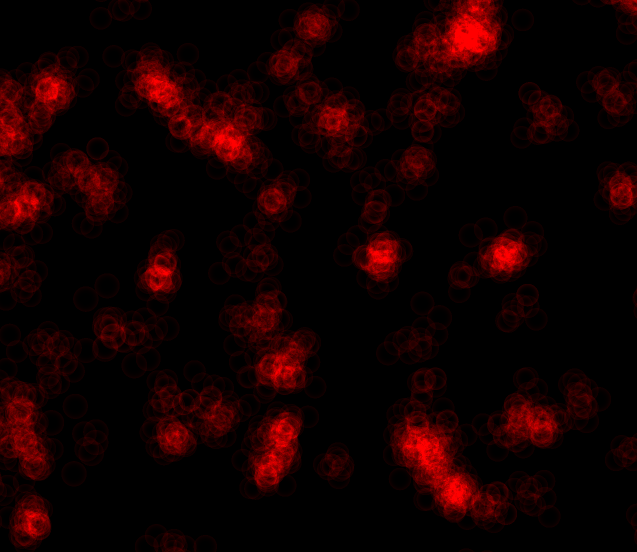
<figcaption><strong>Thin bubbles</strong> — napari-particles' second bubble: a thin bright rim.</figcaption>
</figure>
<figure markdown>
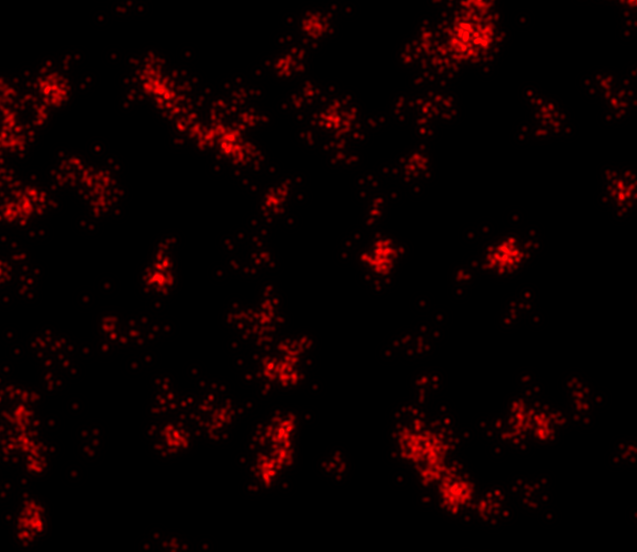
<figcaption><strong>Airy-like</strong> — napari-particles' airy: concentric rings fading outwards.</figcaption>
</figure>
<figure markdown>
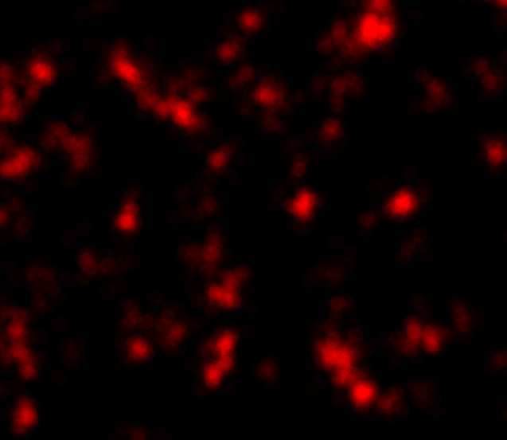
<figcaption><strong>Fresnel</strong> — napari-particles' fresnel: a flat core with rippled edges.</figcaption>
</figure>
<figure markdown>
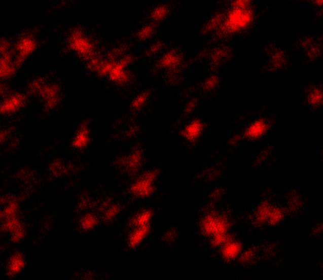
<figcaption><strong>Julia fractal</strong> — napari-particles' fractal: a Julia set on every localization.</figcaption>
</figure>
<figure markdown>
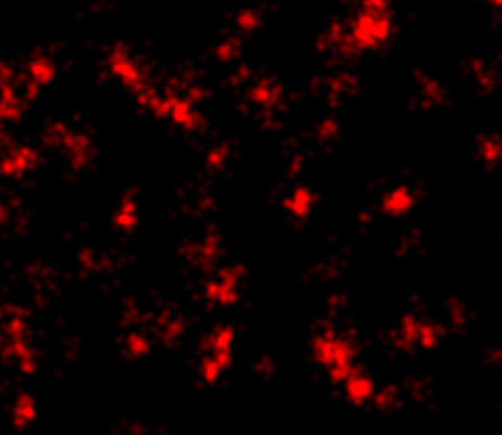
<figcaption><strong>Polynomial Gaussian</strong> — napari-particles' gaussian2: a polynomial stand-in for the Gaussian.</figcaption>
</figure>
<figure markdown>
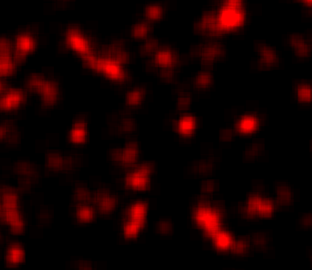
<figcaption><strong>Tiles</strong> — napari-particles' none: the whole billboard, flat.</figcaption>
</figure>

## Options

**Use uncertainty** sizes and shapes each localization by its own measured
uncertainty instead of one fixed width, so that **Rings** become one
uncertainty ellipse per localization. It is the same switch as
[**Variable-size gaussian**](rendering.md#gaussian-width) in Data Controls --
ticking one ticks the other -- and needs data that records an uncertainty.

**Smallest on screen [px]:** keeps an alternative visualisation at least this
many pixels across when you zoom out, so it stays visible over a whole field
of view; 0 lets it shrink with the data. The scientific Gaussian is never
enlarged.

The style is saved in a [scene](export.md#scenes).
